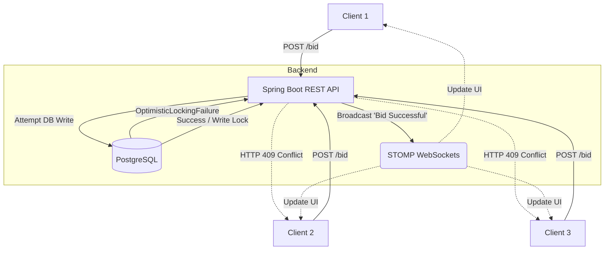

# ⚡ Lightning Bids V1 - Real-Time Auction Engine
A high-performance, real-time auction bidding engine built with **Spring Boot 3**, **PostgreSQL**, and **STOMP WebSockets**.

### 💥 The Problem
Traditional databases and legacy auction APIs struggle to maintain data consistency when hundreds of users submit bids at the exact same millisecond. These race conditions often lead to lost updates or illegal state transitions, making it very difficult to guarantee fairness and reliability at scale.

### ✅ The Solution
Built a real-time auction engine MVP explicitly engineered to handle extreme concurrency using Clean Architecture. Implemented strict PostgreSQL Optimistic Locking (`@Version`) to guarantee database isolation. When users submit conflicting bids, the engine securely catches `ObjectOptimisticLockingFailureException`, returning clean HTTP `409 Conflict` rejections, while the single successful transaction is instantly broadcasted over Spring STOMP WebSockets.

### 📈 The Outcome
Demonstrated zero-loss concurrency control for high-frequency transactions. The attached test dashboard actively proves that firing 50 simultaneous programmatic requests into the lock successfully processes 1 winner and instantly catches 49 rejections, avoiding race conditions entirely.

---

## 🏗️ Architecture Diagram



- **REST API:** Handles immutable state requests and authenticated order execution (`POST /api/auctions/{id}/bid`).
- **Security:** Stateless **JWT authentication** managed universally via a custom Spring Security filter chain.
- **Real-Time Engine:** Uses Spring **STOMP WebSockets** (`/ws`) natively functioning as a one-way megaphone to broadcast successful transactions instantly across all connected client nodes.

---

## 🚀 Quick Start

### Prerequisites
- Java 21+
- Maven
- Docker

### 1. Start the Database
Run the local PostgreSQL instance securely via Docker:
```bash
docker-compose up -d
```

### 2. Boot the Application
The `application.properties` is configured by default to aggressively drop the database tables and securely seed fresh test data upon every initialization.
```bash
mvn spring-boot:run
```

### 3. Concurrency Stress Test (The Frontend)
Navigate to `http://localhost:8080` to access the vanilla JS/CSS **High-Frequency Execution Desk**. 

Register a quick test account, select the active auction, and click the **🚀 STRESS TEST** button to forcefully fire 50 concurrent fetch requests into the exact same millisecond window. The local UI terminal will tally the precise number of transactions that successfully won the underlying lock vs those intercepted by the database engine.

---

## ☁️ Deployment Guide (Railway)
This application supports seamless environment variable injection for CI/CD production deployment.

1. Connect your GitHub repository to [Railway.app](https://railway.app).
2. Provision a PostgreSQL database add-on.
3. Supply the following environment variables to your Spring Boot service:
   - `DB_URL` = `jdbc:postgresql://${{Postgres.PGHOST}}:${{Postgres.PGPORT}}/${{Postgres.PGDATABASE}}`
   - `DB_USERNAME` = `${{Postgres.PGUSER}}`
   - `DB_PASSWORD` = `${{Postgres.PGPASSWORD}}`
   - `DDL_AUTO` = `update` *(Required to prevent PostgreSQL data loss on server pushes)*

---

## 🗺️ Future Roadmap
While this MVP achieves database lock integrity, hitting the physical disk for thousands of concurrent bids causes severe bottlenecks. Here is what I plan to build next to help the product grow:
1. **Redis Queueing:** Funnel the instantaneous HTTP firehose through a Redis Cache to rapidly batch-process optimistic lock acquisitions in memory.
2. **JWT Refresh Tokens:** Implement a strict 15-minute Access Token paired with an `HttpOnly` cookie-stored Refresh Token.
3. **Apache Kafka Event Streams:** Decouple the STOMP WebSocket broadcasts into an event stream to allow seamless horizontal pod scaling.
